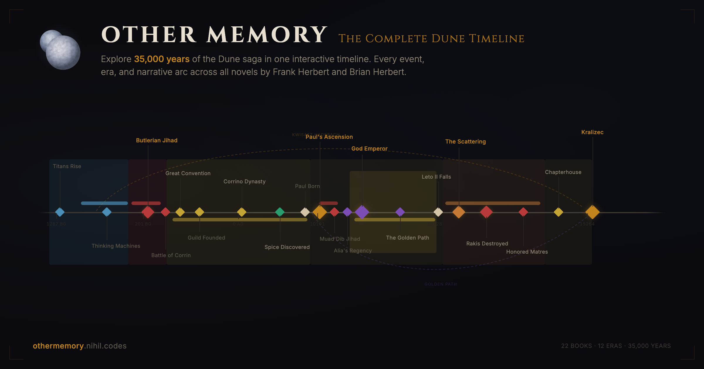

# Other Memory: The Complete Dune Timeline

[](https://othermemory.nihil.codes)

An interactive timeline of the entire Dune universe. 35,000 years of history across all 22 novels by Frank Herbert, Brian Herbert, and Kevin J. Anderson, in one zoomable view.

Check it out at **[othermemory.nihil.codes](https://othermemory.nihil.codes)**

---

## What is this?

The name comes from the Bene Gesserit ability to access ancestral memories spanning millennia. This site lets you do the same thing: explore the complete chronology of Dune, from the Time of Titans through Kralizec, in a single continuous timeline.

You can zoom from a 35,000-year bird's-eye view all the way down to individual events within a single book. See where you are in the story, how events connect across millennia, and where Frank Herbert placed his saga in humanity's deep future.

### Features

- **Zoomable timeline** with 6 zoom tiers, from full history down to individual years
- **95+ events** across all narrative periods, with more being added by the community
- **Dual calendar overlay** showing Dune's AG/BG calendar alongside two real-world CE mappings (Expanded Dune and Dune Encyclopedia), each with a "Today" marker
- **Book filter** to select which book you're reading. Reading Mode hides future events to prevent spoilers
- **Search** to find events, characters, and factions instantly
- **Narrative arcs** that visually connect events like The Golden Path and the Kwisatz Haderach breeding program
- **Movies & TV shows** displayed as timeline bands, from Lynch's 1984 film through Dune: Prophecy
- **Density heatmap** showing where events cluster, even at full zoom out
- **Detail panel** with full descriptions, book references, characters, factions, and related events
- **Keyboard shortcuts** for power users (press `?` to see them all)
- **Shareable URLs** where every view state is encoded in the URL
- **Community-driven data** stored as YAML files that anyone can contribute to

---

## For Dune fans

This timeline is built by fans, for fans, and we'd love your help making it the most accurate Dune chronology out there.

**Think we got a date wrong?** The Dune universe has real ambiguities across sources. We've documented where dates disagree (like Paul's desert walk at 10,207 vs 10,210 AG) and picked the most book-consistent interpretation. If you have evidence for a different reading, we want to hear it.

**Know of a missing event?** We have 95 events and growing, but there are hundreds more across the novels. Every contribution helps.

**Want to discuss timeline placement?** Open a [GitHub Discussion](https://github.com/vishalvshekkar/other-memory/discussions) to talk through ambiguities or proposals before submitting a PR.

See [CONTRIBUTING.md](CONTRIBUTING.md) for guidelines, or browse the [docs/](docs/) folder for schema references and step-by-step guides.

---

## Tech stack

| | |
|---|---|
| Build | Vite |
| Language | TypeScript (strict) |
| UI | React 19 |
| Timeline | HTML Canvas (custom 8-layer renderer) |
| Styling | Tailwind CSS 4 |
| Data | YAML files validated at build time |

## Quick start

```bash
git clone https://github.com/vishalvshekkar/other-memory.git
cd dune-timeline
npm install
npm run dev
```

Then open `http://localhost:5173`.

## Keyboard shortcuts

| Key | Action |
|-----|--------|
| `Scroll` | Zoom at cursor |
| `Drag` | Pan timeline |
| `Click` | Select event |
| `← →` | Pan |
| `+ -` | Zoom in/out |
| `1`-`6` | Jump to zoom tier |
| `0` | Fit entire timeline |
| `/` | Search |
| `F` | Filters |
| `B` | Book selector |
| `Esc` | Close panel |
| `?` | Shortcuts reference |

## Contributing

All timeline data lives in `data/` as YAML files. You don't need programming experience to contribute, just basic YAML editing.

```bash
npm run validate   # Check your changes before submitting
```

Guides:
- [Adding events](docs/adding-events.md)
- [Adding eras](docs/adding-eras.md)
- [Adding narrative arcs](docs/adding-arcs.md)
- [Adding movies & TV shows](docs/adding-media.md)
- [Data schema reference](docs/data-schema.md)
- [Calendar system explained](docs/calendar-system.md)
- [Contribution workflow](docs/contribution-workflow.md)

## Project structure

```
data/                        # Timeline data (YAML) — this is what you edit
├── config.yaml              # Calendar configuration
├── books.yaml               # 22 book definitions
├── eras.yaml                # 12 era/epoch definitions
├── categories.yaml          # 7 event categories with colors
├── factions.yaml            # 12 faction definitions
├── media.yaml               # 7 screen adaptations (movies & TV)
├── events/                  # Events grouped by narrative period
│   ├── butlerian-jihad.yaml
│   ├── corrino-empire.yaml
│   ├── prelude-era.yaml
│   ├── dune-saga.yaml
│   ├── god-emperor.yaml
│   ├── the-scattering.yaml
│   └── return-and-kralizec.yaml
└── arcs/                    # Narrative arc definitions
    ├── golden-path.yaml
    └── kwisatz-haderach.yaml
src/                         # Application source (TypeScript + React)
├── components/              # React UI components
├── timeline/                # Canvas renderer, camera, interactions
└── types/                   # TypeScript type definitions
```

## The two Dune calendars

Dune uses AG (After Guild) / BG (Before Guild) dating. But how does that map to our real-world calendar? Two canonical sources disagree:

- **Expanded Dune** (Brian Herbert & KJA): 11,200 BG = 1960 CE, so AG 0 = **13,160 CE**
- **Dune Encyclopedia** (1984): 16,200 BG = 0 CE, so AG 0 = **16,200 CE**

Toggle the **CE** button on the site to see both mappings at once. See [docs/calendar-system.md](docs/calendar-system.md) for the full explanation.

## License

MIT
